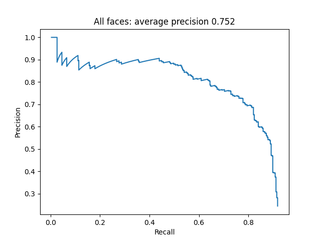
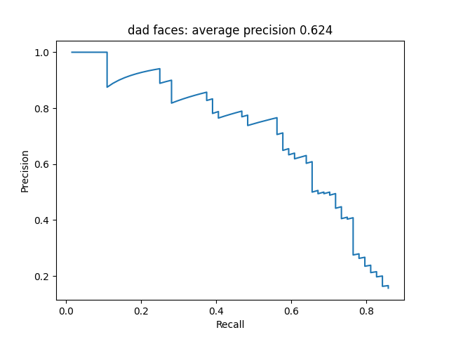
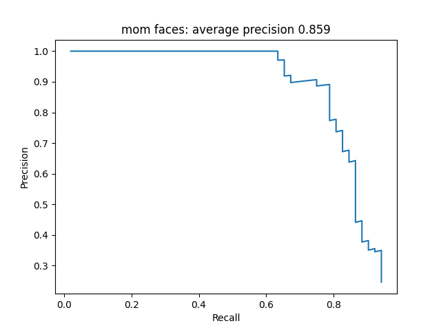
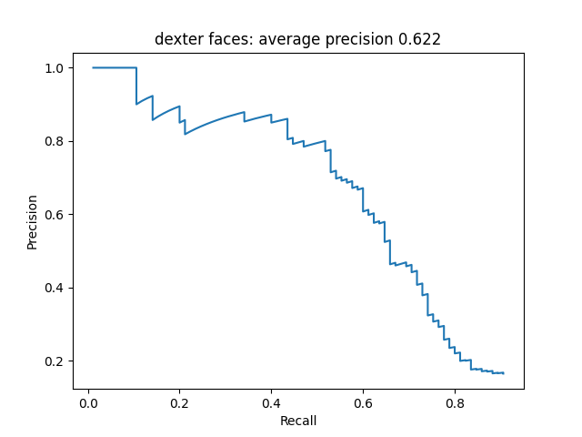
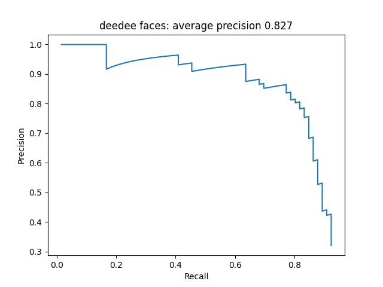

# Facial Detector and Recognizer

This project focuses on detecting and recognizing the faces of characters from Dexter's Laboratory in a set of provided images. It consists of two main tasks: face detection and face classification, with an optional bonus task using a state-of-the-art YOLO model for improved results.

## Introduction
The goal of this project is to detect and recognize the faces of characters from Dexter's Laboratory in a given set of images. The project is divided into two main tasks:

1. Face Detection: Detecting faces in the images.

2. Face Classification: Classifying the detected faces into one of the four main characters (Dad, Mom, Dexter, DeeDee) or an "Unknown" category.

Additionally, a bonus task involves using the YOLOv8 model for state-of-the-art face detection and classification.

## Tasks

### Task 1: Face Detection
The objective is to detect faces in the images using a sliding window approach with Histogram of Oriented Gradients (HOG) descriptors. The approach involves:

- Extracting positive and negative HOG descriptors.

- Training an SVM classifier with an RBF kernel.

- Using a multi-scale approach to detect faces of varying sizes.

- Applying non-maximum suppression to filter overlapping detections.

### Task 2: Face Classification
The goal is to classify the detected faces into one of the four main characters or the "Unknown" category. The approach includes:

- Training separate SVM classifiers for each character using HOG descriptors.

- Using a multi-scale approach for detection and classification.

- Combining results from multiple classifiers to improve accuracy.

### Bonus Task: YOLO Model
The bonus task involves using the YOLOv8 model for face detection and classification. The steps include:

- Preparing the dataset in the required YOLO format.

- Training the YOLOv8 model on the dataset.

- Processing the model's output to match the project's format.

## Approach

### General Methodology

1. Preprocessing:

   - Analyze the training images to determine face sizes and aspect ratios.

   - Use histograms to identify the most common aspect ratios for each character.

2. Feature Extraction:

   - Extract HOG descriptors from positive (faces) and negative (non-faces) examples.

   - Augment the dataset by flipping images and resizing patches.

3. Model Training:

   - Train SVM classifiers with an RBF kernel for both detection and classification tasks.

   - Use a multi-scale approach to handle faces of varying sizes.

4. Prediction:

   - Apply the trained models to detect and classify faces in new images.

   - Use non-maximum suppression to refine detections.

### YOLO Approach
- Convert the dataset into the YOLO format.

- Train the YOLOv8 model on the dataset.

- Process the model's output to generate detection and classification results.

## Results

### Task 1: Face Detection

Achieved an average precision of 75%:

  

### Task 2: Face Classification
Achieved the following average precisions for each character:

- Dad: 62%

- Mom: 86%

- Dexter: 62%

- DeeDee: 83%

  

    

### Bonus Task: YOLO Model
Achieved near-perfect detection and classification results using YOLOv8.
